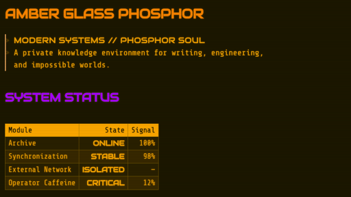

# Amber Glass Phosphor

Amber Glass Phosphor is a dark, CRT-inspired theme for Obsidian. It is intended to bring my vision of a retro-futuristic interface to Obsidian while remaining easy on the eyes and helping with concentration. Multicolored headings make navigation quicker.

## Features

- Amber, green, and white phosphor palettes.
- Embedded offline fonts with no network requests.
- Matching Reading view, Live Preview, interface, and PDF-export styling.
- Optional CRT scanlines and vignette.
- Optional phosphor text glow.
- Square, terminal-inspired controls and panes.
- Style Settings integration.

## Changelog

### Version 1.0.1

- Reduced the embedded 3270 Nerd Font size by removing unused private-use icon glyphs.

### Version 1.0.2

- Fixed the settings menu tabs so they are now readable.

### Version 1.0.3

* Improved phosphor palette consistency across tabs, links, checkboxes, highlights, and dropdown menus.
* Fixed inactive and unfocused tab readability.
* Corrected white-phosphor glow and selection colors.
* Removed redundant CSS while retaining Style Settings compatibility.

## Installation

### Manual installation

1. Create a folder named `Amber Glass Phosphor` inside your vault's `.obsidian/themes` directory.
2. Copy `theme.css` and `manifest.json` into that folder.
3. Open **Settings → Appearance → Themes** in Obsidian.
4. Select **Amber Glass Phosphor**.

### Community Themes

Once the theme is accepted into the Obsidian Community directory, it can be installed through **Settings → Appearance → Themes → Manage**.

## Style Settings

The optional [Style Settings](https://github.com/mgmeyers/obsidian-style-settings) community plugin exposes the theme's built-in controls. After enabling the plugin, open **Settings → Style Settings → Amber Glass Phosphor**.

Available controls:

- **Phosphor palette:** Amber, Green, or White.
- **Disable CRT overlay:** Removes scanlines and the edge vignette.
- **Disable text glow:** Removes glow while retaining the selected palette.

Amber remains the default when Style Settings is not installed.

## Fonts

The theme embeds WOFF2 conversions of:

- Share Tech Mono
- 3270 Nerd Font
- Audiowide

The embedded copies use theme-specific internal aliases. Their original copyright notices, project links, and SIL Open Font License information are available in [`licenses/fonts`](licenses/fonts/README.md).

## License

Amber Glass Phosphor is released under the [MIT License](LICENSE).

The embedded fonts are separately licensed under the SIL Open Font License 1.1. See [`licenses/fonts`](licenses/fonts/README.md) for attribution and license details.
